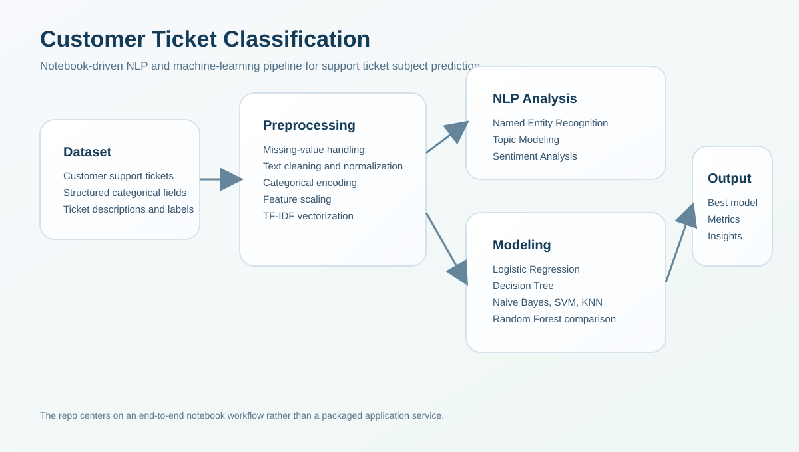

# Customer Ticket Classification

An end-to-end machine-learning and NLP project for classifying customer support tickets by subject. The repository uses a notebook-driven workflow to move from raw ticket data through exploratory analysis, preprocessing, NLP feature work, model comparison, and final evaluation.



## Overview

This project focuses on predicting the **Ticket Subject** from a support-ticket dataset that contains both structured fields and free-text descriptions. It is designed as a full workflow project rather than a single-model demo, and includes:

- exploratory data analysis
- data cleaning and preprocessing
- categorical feature engineering
- TF-IDF text vectorization
- multiple classification models
- extra NLP analysis such as NER, topic modeling, and sentiment analysis

## Dataset

The dataset contains roughly **8,470** customer support tickets and includes fields such as:

- Ticket ID
- Product Purchased
- Ticket Type
- Ticket Priority
- Ticket Channel
- Ticket Status
- Ticket Description
- Ticket Subject

Target label:

- `Ticket Subject` with 16 possible classes

## Workflow

The notebook-based pipeline covers:

1. loading and inspecting the dataset
2. exploratory data analysis across categorical, numerical, and text fields
3. cleaning and normalizing ticket descriptions
4. encoding structured features
5. converting text with TF-IDF
6. running additional NLP analysis
7. training multiple classifiers
8. comparing metrics and selecting the strongest model

## NLP Tasks Included

- Named Entity Recognition with spaCy
- Topic Modeling with LDA
- Sentiment Analysis with TextBlob
- Text vectorization with TF-IDF

These tasks make the repo stronger than a basic “fit one classifier” notebook because they show broader NLP reasoning around the dataset.

## Models Compared

The project evaluates several classical ML models:

- Logistic Regression
- Decision Tree
- Naive Bayes
- Support Vector Machine
- K-Nearest Neighbors
- Random Forest

According to the project notes, **Random Forest** was the best-performing model in the final comparison.

## Repository Contents

- `customer-ticket-classification.ipynb`: main notebook with the end-to-end workflow
- `customer_support_tickets.csv`: dataset used in the analysis
- `docs/pipeline-overview.svg`: high-level workflow visual

## Running the Project

This work was originally structured for **Google Colab**, so the simplest way to run it is:

1. open `customer-ticket-classification.ipynb` in Google Colab or Jupyter
2. install the required libraries
3. run notebook cells sequentially

### Example dependency setup

```bash
pip install -r requirements.txt
python -m spacy download en_core_web_sm
```

If you are running it in Colab, those commands can be placed into notebook cells.

## Key Project Strengths

- combines structured features and text features
- demonstrates multiple NLP techniques in one workflow
- compares several classical ML baselines
- shows end-to-end thinking from EDA to evaluation
- uses a realistic customer-support use case

## Why This Project Matters

This is a useful portfolio project because it demonstrates:

- practical NLP for customer support automation
- classification on mixed structured + unstructured data
- feature engineering beyond raw text only
- comparative model evaluation
- notebook-based workflow discipline

## Current Repository Status

This repo is best understood as a strong analysis and modeling notebook repository rather than a packaged production app. The core value is in the notebook workflow, dataset handling, and comparative NLP/ML pipeline.

## Author

Abubakar Shahid  
GitHub: <https://github.com/abubakarshahid16>
